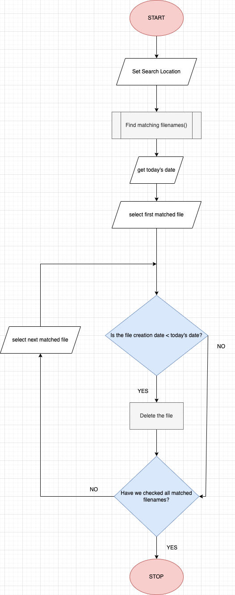

# Automate file deletion

## Introduction

This is a simple python script that can be used to automate the process of deleting files, typically single use files like archive files (.zip, .tar), installation files (.dmg, .exe) etc.
At work, I have often had to access windows servers via a "Remote Deskop Protocol"(.rdp) file which remains authenticated for a few minutes after which the file becomes useless. Instead of
letting the files collect in the downloads folder, the goal was to schedule a script that will delete all of these 'single use' files regularly.

## Table of Contents

1. [Setup](#setup)
2. [How to run the file](#how-to-run-the-file)
3. [Adapting the code for your use](#adapting-the-code-for-your-use)
    * [Program Logic](#program-logic)
    * [Changes to make](#changes-to-make)
4. [Logging](#logging)

## Setup

Simply ensure you have python 3.8 and above installed on your computer. You can download it from [here](https://www.python.org/downloads/).  

All the libraries/modules used in the script, listed below, come preinstalled with the python download:
1. [os](https://docs.python.org/3/library/os.html)
2. [pathlib](https://docs.python.org/3/library/pathlib.html)
3. [logging](https://docs.python.org/3/library/logging.html)
4. [datetime](https://docs.python.org/3/library/datetime.html)

## How to run the file

Open the 'terminal'(MacOS/Linux) or 'powershell'(Windows) on your computer. Navigate, and run the script as follows:
```
$ cd <script path>
$ python main.py
```

**Note:** The code from this repo may not work as is and will need to be tweaked. For steps on how to do so, check out the section -> [Adapting the code for your use](#adapting-the-code-for-your-use).

To actually automate the process, you will have to schedule it as per your choice of cadence using software like "Automator"(MacOS), "Task Scheduler"(Windows), or a "cron" job(Linux) etc. This is 
obviously not needed if you are doing a one time run.

## Adapting the code for your use

### Program Logic

The flow/logic of the script can be understood from the below flowchart:  

  

### Changes to make

The script is designed to be able to run on both Windows and Unix like (MacOS/Linux) systems. This can be seen in the following:
1. Using the 'pathlib' library to generate paths to files/directories. This takes care of the 'forward slash (/)' & 'backward slash (\)' conflicts in operating systems.
2. Using the `pathlib.Path(<path to file>)` function as `pathlib.Path(<path to file>)s.stat().st_mtime` to get the time at which the file was created.

Update the file paths at the following lines:
1. The location for your log file  
    `filehandler` variable
2. The location to search for files  
    `search_loc` variable

Further, to set how old must a file be to be deleted feel free to play with the `today` variable and the `if v < today:` condition. 

## Logging

The `logging` module is used to create informative logs and save them to a `.log` file.  

All logs are saved in the `logs/` directory. Log messages are logged in the below format:  
`"%(asctime)s : %(levelname)s : %(message)s : %(name)s"`  
For more information on log message formatting, refer to the official documentation [here](https://docs.python.org/3/library/logging.html#logrecord-attributes).

